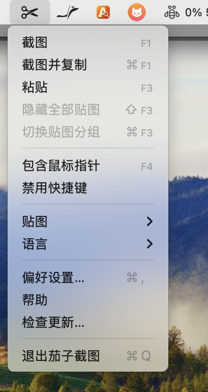
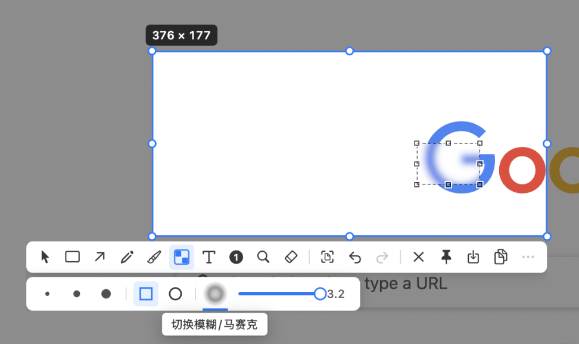
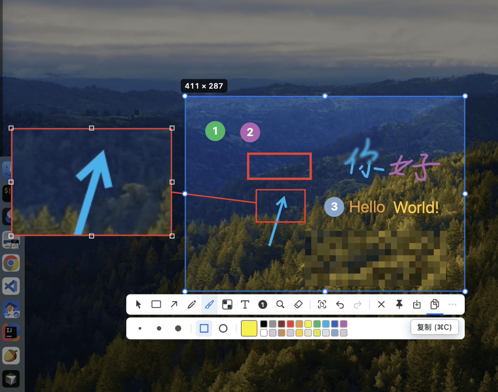

# EggplantShot

原生 **macOS 15+** 菜单栏截图工具 — Snipaste 风格：框选、标注、钉图、贴图。



比 Snipaste好用的地方：
1. 按v可以进入移动(move)模式, 该模式下可以在画布上移动任何标注(比如pencil笔迹)
2. 按逗号调出历史截屏后, 所有标注仍可进行重编辑.
3. Esc误触保护, 在有标注的情况下, 按两次Esc才会退出.

最难发现的功能(切换模糊/马赛克)



[English](./README_en.md)

预编译 DMG（ad-hoc 签名、**未**公证）见 **[Releases](https://github.com/uniquejava/EggplantShot/releases)** — 推送 `v*` 标签即可自动构建。



## 功能

- **截取** — 冻结画面，单击窗口或拖拽框选，精修与标注后钉住 / 复制 / 保存
- **窗口圆角透明** — 单击锁定窗口后，PNG 保留圆角外的透明背景；JPEG 铺白底（[使用说明](./docs/user-guide_zh.md#截取)）
- **截取并复制** — 选区锁定后立刻复制到剪贴板（无工具栏）
- **标注** — 形状、箭头、铅笔、马克笔、马赛克、文字、步骤序号、放大镜、橡皮；支持撤销 / 重做
- **OCR** — 从选区识别**二维码或文字** → 写入剪贴板
- **粘贴（贴图）** — 把剪贴板变成浮动钉图（图片、色卡或文字便签）
- **钉图** — 置顶、拖动、滚轮缩放、一键隐藏 / 显示全部
- **偏好设置** — 登录时启动、界面语言（系统 / 英语 / 简体中文）、快捷键、权限

## 快捷键（默认）

| 操作 | 快捷键 |
|--------|----------|
| 截取 | `F1` |
| 截取并复制 | `⌘F1` |
| 粘贴（剪贴板 → 钉图） | `F3` |
| 隐藏 / 显示全部钉图 | `⇧F3` |
| 包含鼠标指针（开 / 关） | `F4` |

可在偏好设置里改快捷键。菜单栏 → **Disable hotkeys** 可全局暂停。

## 权限

| 权限 | 用途 |
|------------|-----|
| **辅助功能（Accessibility）** | 全局快捷键 |
| **屏幕录制（Screen Recording）** | 截取画面 |

### 重新安装后的权限

重新安装通常不需要重新授权。如果快捷键或截屏失效，即使系统设置里已经勾选，也可以先退出应用，用 `tccutil` 重置茄子截图的两项权限：

```bash
killall EggplantShot 2>/dev/null
tccutil reset Accessibility click.yinsb.EggplantShot
tccutil reset ScreenCapture click.yinsb.EggplantShot
open /Applications/EggplantShot.app
```

随后在「系统设置 → 隐私与安全性」里重新开启**辅助功能**和**屏幕录制**，并按系统提示重启应用。这些命令只重置茄子截图，不影响其他 App。

## 编译运行

需要 macOS 15+ 与 Xcode 16+。

```bash
killall EggplantShot 2>/dev/null
xcodebuild -project EggplantShot.xcodeproj -scheme EggplantShot \
  -configuration Debug -derivedDataPath build build
open build/Build/Products/Debug/EggplantShot.app
```

或：`open EggplantShot.xcodeproj`

务必使用 `-derivedDataPath build`，并先结束已在运行的实例，否则可能打开旧二进制。

## 文档

- [使用指南](./docs/user-guide_zh.md)
- [AGENTS.md](./AGENTS.md) — 架构与贡献 / Agent 说明（英文）
