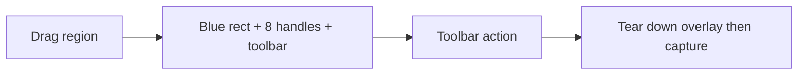

# Selection refine + toolbar (next)

Status: **implemented** (Pin / Copy / Cancel + 8 handles + move).  
Deferred: annotate, save file, magnifier, etc. (see toolbar scope below).

## Previous behaviour (MVP)

1. F1 / menu **Snip** → full-screen dim overlay.
2. Drag a rectangle → **on mouse-up, immediately** capture → pin (or clipboard for ⌘F1).
3. Esc during drag cancels; Esc / double-click on a **pinned** image closes that pin.

## Desired behaviour (Snipaste-like)

1. User presses **F1** (or Snip) and **drags** a rough region.
2. On mouse-up (if region is large enough), **do not capture yet**. Enter **refine mode**:
   - Dimmed surroundings remain.
   - Selection shown as a **blue rectangle** (not white-only border).
   - **8 resize handles** (corners + edge midpoints); drag to resize.
   - Drag **inside** the rect (not on a handle) to **move** the selection.
   - Size label (e.g. `W × H`) stays visible near the rect.
3. A **toolbar** appears **below** the selection (if near screen bottom, flip **above**):
   - Confirm / pin (primary for Snip)
   - Copy to clipboard
   - Cancel (also **Esc**)
   - Placeholders OK for later Snipaste tools (annotate, save file, etc.) — see below.
4. Only when the user confirms an action does the overlay tear down, then capture the **final** rect (same rule: overlay must not appear in the image).
5. **Esc** in refine mode cancels the whole snip (no pin / no clipboard). Esc on an already-pinned image still closes that pin only.

### Snip vs Snip and copy

| Entry | Default toolbar primary | Notes |
|-------|-------------------------|--------|
| **Snip** / F1 | Pin (confirm) | Copy remains available on toolbar |
| **Snip and copy** / ⌘F1 | Copy | Pin can still be available on toolbar |

If refine mode is shared, pass the entry mode so the primary button matches.

## Toolbar scope for first implementation

**Must have**

- Pin / Confirm
- Copy
- Cancel (+ Esc)
- 8 handles + move selection
- Toolbar repositions when rect is near screen edges

**Defer (stubs or omit)**

- Freehand / shape annotate, text, mosaic blur
- Save to file, upload, QR decode, color picker
- Magnifier, aspect-ratio locks, multi-display cross-screen refine polish beyond “rect lives on one screen”

Document stubs in UI only if they help layout parity; do not fake capture side-effects.

## Implementation notes (for the next session)

Primary touch point: [`EggplantShot/Controllers/SelectionOverlayController.swift`](../EggplantShot/Controllers/SelectionOverlayController.swift)

Suggested approach:

- Split interaction into phases: `drawing` → `refining` → `finished(action, rect)`.
- On first mouse-up in `drawing`, if `width/height >= 2`, switch to `refining` instead of `finish(.selected)`.
- Hit-test handles with a small target (~8–10pt) in global Cocoa coordinates.
- Outcome API should expand beyond `selected(CGRect)`, e.g. `confirmed(rect, action: pin|copy)` / `cancelled`, so [`SnipController`](../EggplantShot/Controllers/SnipController.swift) only captures after confirm.
- Toolbar: AppKit `NSPanel` / bar view anchored to the selection’s screen; keep logic in Controllers (AppKit), not SwiftUI MenuBarExtra.

Also update **Product behaviour** in [`AGENTS.md`](../AGENTS.md) once this ships (Snip no longer “drag → immediate pin”).

## Acceptance checklist

- [x] Mouse-up after drag shows blue rect + 8 handles; no pin/clipboard yet
- [x] Handles resize; interior drag moves; size label updates
- [x] Toolbar under (or above) selection; Pin / Copy / Cancel work
- [x] Esc cancels refine without capturing
- [x] Confirm tears down overlay, then captures final rect; pin or clipboard as chosen
- [x] ⌘F1 entry still reachable; primary action sensible for that mode
- [x] Debug build still succeeds; Screen Recording / Accessibility behaviour unchanged
