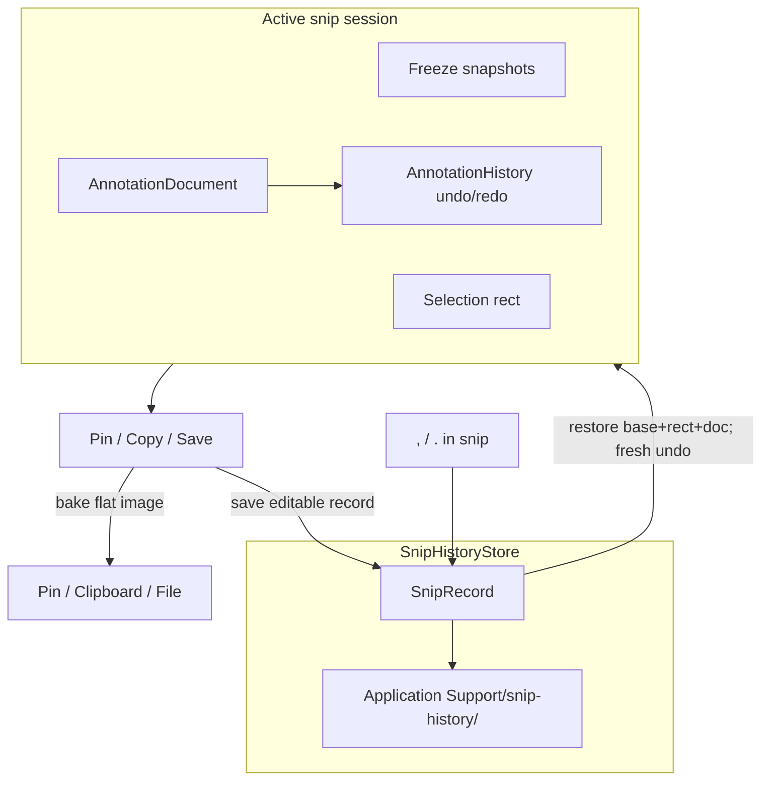

# Snip Document architecture

Status: **P0–P4 implemented** (document + undo/redo; disk `SnipRecord`; `,` / `.` playback; extensible `AnnotationPayload`).  
Related UI behaviour: [`selection-refine.md`](selection-refine.md).

This document defines the extensible model for annotations, session undo/redo, and Snipaste-like snip history playback (`,` / `.`), including on-disk persistence.

## Goals

1. **One editable document** for all annotate tools so undo/redo and history playback stay tool-agnostic.
2. **Non-destructive until confirm**: Pin / Copy / Save bake a flat image for the outside world; the app keeps an editable `SnipRecord` (base image + document).
3. **Snipaste-style history**: during an active snip, `,` / `.` step through prior records and continue editing.
4. **Survive relaunch**: records live in Application Support (memory cache + disk).

## Non-goals

- Restoring the **undo/redo stack** when loading a `SnipRecord` (fresh empty history after restore).
- Re-splitting layers from an already-baked **pin window** or exported PNG/JPEG.
- Snipaste **`R`** (restore last selection rect only) — separate task if needed.
- Changing App Sandbox (remains OFF).

## Locked decisions

| Topic | Choice |
|-------|--------|
| Persistence | Memory + disk under Application Support |
| `,` / `.` restore | Base image + selection + `AnnotationDocument` only |
| Undo strategy | Whole-document snapshots via `AnnotationHistory` |
| When to append history | Only on successful Pin / Copy / Save confirm |
| Capacity | Default last **20** records; drop oldest |

## Mental model



- **Session**: live freeze (or restored base), selection, document, undo stacks.
- **Export**: composite document onto base → flat `NSImage`.
- **Archive**: same base (unannotated) + document → `SnipRecord` for later `,` / `.`.

## Core types

### `Annotation` (mark)

One drawable mark. Geometry is **selection-local** Cocoa points (origin = selection bottom-left), same as today.

```swift
enum ShapeKind: Equatable { case rectangle, ellipse }

enum AnnotationPayload: Equatable {
    case shape(ShapeKind, rect: CGRect, style: AnnotationStyle)
    case arrow(start: CGPoint, end: CGPoint, style: AnnotationStyle, caps: ArrowCaps)
    case pencil(points: [CGPoint], style: AnnotationStyle)
    case text(string: String, rect: CGRect, style: TextStyle)
    // later: marker, mosaic, step, …
}
```

Disk schema v1 writes marks with a `type` discriminator (`"shape"`, `"arrow"`, `"pencil"`, `"text"`, …). Shape keeps `kind` / `rect`; arrow stores `points: [start, end]` + `startCap` / `endCap` (+ optional hull `rect`); pencil stores `points` (+ optional hull `rect`); text stores `string` / `rect` / `textStyle`. Unknown `type` values are skipped on load.

### `AnnotationDocument`

The **only** undoable annotation state:

```swift
struct AnnotationDocument: Equatable {
    var marks: [Annotation]
    var selectedID: UUID?
}
```

Tool prefs (stroke width, palette, shape kind for *next* draw) stay outside the document (existing `AnnotationPrefs`); changing prefs without touching a selected mark is **not** an undo step. Applying style/kind **to the selected mark** is an undo step.

### `AnnotationHistory`

Owns `document` plus undo/redo snapshot stacks. **All** mark mutations go through this type — never mutate `marks` / `selectedID` from gesture code directly.

Suggested API:

```swift
@MainActor
final class AnnotationHistory {
    private(set) var document: AnnotationDocument
    var canUndo: Bool { … }
    var canRedo: Bool { … }

    /// Snapshot current doc, then mutate. Clears redo.
    func commit(_ body: (inout AnnotationDocument) -> Void)

    /// Drag/resize: remember baseline once; live-mutate `document` without pushing.
    func beginGesture()
    /// If document ≠ baseline, push baseline onto undo and clear redo.
    func endGesture()

    func undo()
    func redo()
    func reset(to document: AnnotationDocument) // used by history restore; clears stacks
}
```

**What counts as one undo step** (commit or successful endGesture):

| Action | When recorded |
|--------|----------------|
| Finish drawing a mark | mouse-up if size ≥ minimum |
| Move / resize mark | endGesture if rect changed |
| Style / kind on selection | immediate `commit` |
| Delete selection | immediate `commit` |
| Clear marks on re-select | `commit` that empties marks (see below) |

Do **not** push on every mouse-dragged frame.

### `SnipRecord`

Cross-session editable unit:

```swift
struct SnipRecord: Identifiable {
    let id: UUID
    let createdAt: Date
    /// Unannotated crop (points size matches selection).
    var baseImage: NSImage
    /// Selection in **Cocoa global** screen coordinates (bottom-left origin).
    var selection: CGRect
    var document: AnnotationDocument
}
```

`selection.size` must match `baseImage.size` in points (1× logical; backing scale stored implicitly via PNG pixel size / `NSImage` representations as needed — see Disk format).

### `SnipHistoryStore`

Ordered list of records (newest at end or a documented cursor — pick **newest last**, browse with an index).

Responsibilities:

- `append(_ record:)` → memory + disk; enforce max count
- `records` / `record(at:)` / `count`
- `loadFromDisk()` on launch
- prune oldest directories when over capacity

Owned by `SnipController` (or a small collaborator it holds). Overlay asks the store for prev/next during snip.

## Code ownership (target layout)

```
EggplantShot/Annotation/
  AnnotationModels.swift      # Annotation, style, prefs (existing)
  AnnotationDocument.swift    # Document + History (new)
  AnnotationCompositor.swift  # bake only (unchanged role)
  AnnotationCoding.swift      # Codable DTOs / color coding (new, with P2)

EggplantShot/History/         # or under Annotation/
  SnipRecord.swift
  SnipHistoryStore.swift
```

| Piece | Owner |
|-------|--------|
| Live `AnnotationHistory` | `SelectionOverlayController` |
| Confirm → bake + `append` record | `SnipController` (after overlay outcome) |
| Disk I/O | `SnipHistoryStore` |
| Composite | `AnnotationCompositor` (marks + base only) |

### Migration from current code

P0–P4 done:

- Overlay routes mutations through `AnnotationHistory`, returns `AnnotationDocument` on confirm.
- `SnipController` composites for output and appends `SnipRecord` (memory + disk).
- `,` / `.` restore selection + base + document into the active overlay.
- Marks use `AnnotationPayload` (`shape`, `pencil`); disk `type` discriminator ready for new tools.

Next product work: marker / mosaic / … add payload cases + drawing + hit-testing only.

## Coordinate conventions

| Space | Use |
|-------|-----|
| Cocoa global | Selection rect on screen; multi-display OK; same as current overlay `currentRect` |
| Selection-local | Annotation geometry; origin = selection bottom-left |
| Image pixels | `base.png`; write PNG at capture pixel size; `NSImage.size` stays in points |

When restoring a record:

1. Set overlay selection to `record.selection` (global).
2. Use `record.baseImage` as the refine **content** for that rect (playback mode), not a fresh crop from the current freeze.
3. `history.reset(to: record.document)`.
4. Keep or discard the live freeze backdrop outside the selection as convenient; dimmed “rest of screen” may still show the *current* freeze — only the editable crop must come from the record. **Implemented:** record base is drawn inside the selection; freeze remains elsewhere.

## Session interactions

### Undo / redo (in-session)

- Toolbar Undo / Redo enabled from `canUndo` / `canRedo`.
- Keys: **⌘Z** undo; **⇧⌘Z** redo (⌘Y optional alias).
- Selecting a different annotate tool does not itself push history.

### Re-select (click dimmed area, new drag)

Keep current product behaviour: starting a new rough selection **clears** annotations. Implement as `history.commit { $0.marks = []; $0.selectedID = nil }`. Does **not** write a `SnipRecord`.

### Confirm (Pin / Copy / Save)

1. Crop unannotated base from freeze (or use playback base if already a record image).
2. Read `document` from history.
3. `AnnotationCompositor.composite(document.marks, onto: base)`.
4. Tear down overlay; perform pin / clipboard / save with baked image.
5. `store.append(SnipRecord(baseImage: base, selection: rect, document: document))`.

Esc / cancel: no append.

### History playback (`,` / `.`)

Only while snip overlay is active (Snipaste “snip only” keys).

| Key | Action |
|-----|--------|
| `,` | Previous record (older) |
| `.` | Next record (newer) |

Behaviour:

- If store empty or no neighbour: no-op.
- Load base + selection + document; **new empty** undo/redo stacks.
- User may edit further; confirming appends a **new** record (does not overwrite the browsed one unless we later add explicit replace — default: always append).

Browsing index: remember `historyCursor` during the session (into the store). After a new confirm in a later snip, cursor resets to newest.

## Disk format

Root:

```
~/Library/Application Support/click.yinsb.EggplantShot/snip-history/
  index.json
  <uuid>/
    meta.json
    base.png
```

### `index.json`

```json
{
  "schemaVersion": 1,
  "maxCount": 20,
  "ids": ["uuid-oldest", "…", "uuid-newest"]
}
```

### `meta.json`

```json
{
  "schemaVersion": 1,
  "id": "A1B2C3D4-…",
  "createdAt": "2026-08-13T05:00:00Z",
  "selection": { "x": 100, "y": 200, "w": 640, "h": 400 },
  "imagePoints": { "w": 640, "h": 400 },
  "document": {
    "selectedID": null,
    "marks": [
      {
        "id": "…",
        "type": "shape",
        "kind": "rectangle",
        "rect": { "x": 10, "y": 20, "w": 100, "h": 50 },
        "style": {
          "strokeWidth": 3.5,
          "isFilled": false,
          "lineStyle": 0,
          "color": { "r": 0, "g": 0.64, "b": 0.91, "a": 1 }
        }
      }
    ]
  }
}
```

- `lineStyle`: raw value of `StrokeLineStyle`.
- Unknown `type` on load: skip mark or fail record (prefer **skip mark + log** so one bad mark does not drop the whole history entry).
- `base.png`: unannotated pixels; must match selection aspect/size.

No sandbox entitlements required (Sandbox OFF).

## Extensibility rules

1. New tools add payload cases + drawing + hit-testing; they **must** mutate only via `AnnotationHistory`.
2. Prefer storing mosaic/blur as **data** (regions/strokes), not destructive pixels on `baseImage`, so undo and `,` stay cheap.
3. Bump `schemaVersion` when meta shape changes; keep a single loader switch.
4. Do not bake into `baseImage` until confirm; playback always edits vectors on the saved base.

## Implementation phases

### P0 — Document + History skeleton

- [x] Add `AnnotationDocument` + `AnnotationHistory`
- [x] Route shape draw / move / resize / style / kind / delete through commit / gesture
- [x] Wire toolbar Undo / Redo + ⌘Z / ⇧⌘Z; disabled when stacks empty
- [x] Acceptance: draw → style → move → undo returns prior states; redo works; Esc still cancels snip

### P1 — Confirm produces in-memory `SnipRecord`

- [x] On confirm, retain unannotated base + document (before/without relying on bake)
- [x] `SnipHistoryStore` in-memory `append` only
- [x] Acceptance: after pin, in-debugger / temporary API can read last record marks matching what was drawn

Debug: `AppState.shared.snipController.historyStore.newest` (or `.records`).

### P2 — Disk `SnipHistoryStore`

- [x] Write `index.json` + per-record `meta.json` / `base.png`
- [x] Load on launch; prune to `maxCount`
- [x] Codable path for colors and marks (`schemaVersion` 1)
- [x] Acceptance: quit and relaunch; store still lists prior records with images

Disk root: `~/Library/Application Support/click.yinsb.EggplantShot/snip-history/`

### P3 — `,` / `.` playback

- [x] Key handling in overlay (local key monitor alongside existing Esc/Return)
- [x] Restore selection + base + document; reset undo stacks
- [x] Empty store / ends of list: no-op
- [x] Acceptance: F1 → `,` shows last confirm’s crop and marks; edit + Pin appends a new record

How to try: Pin a snip with shapes → F1 again → press `,` → edit → Pin (appends a new record).

### P4 — Extensible annotation payload

- [x] Introduce `AnnotationPayload` (or equivalent) before arrow/pen land
- [x] Update compositor, hit-testing, and disk `type` discriminator together
- [x] Acceptance: existing shape records from schema v1 still load

New tools add a `AnnotationPayload` case + draw/hit-test; history / store / confirm paths stay unchanged.

Pencil: `.pencil(points:style:)` — freehand polyline (dense live sample + tip poll); Shift → straight any angle; no resize chrome / no auto-select after stroke.

Text: `.text(string:rect:style:)` — click-to-place + inline edit; Bold / Italic / background / font size / color; move + resize handles; Esc ends edit without cancelling snip.

## Relationship to current MVP

| Area | Status |
|------|--------|
| Undo / redo toolbar | Live |
| Confirm | Bake + disk `SnipRecord` |
| `,` / `.` | History playback |
| Pin window | Flat image (no layer reopen) |
| Mark model | `AnnotationPayload` (`shape`, `arrow`, `pencil`, `text`) |

Toolbar chrome and shape UX remain defined in [`selection-refine.md`](selection-refine.md); this file owns document/history/persistence only.
